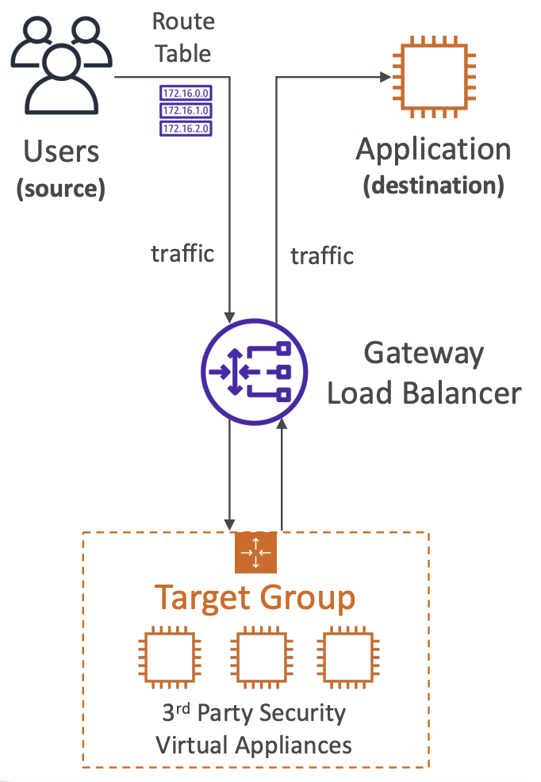

## Gateway Load Balancer

We can have some sort of a Gateway which route the traffic to 3rd party security virtual appliance before traffic reach our application. So we can have of intrusion detection and prevention system, firewall, deep packet inspection, payload manipulation and so on. It act as single entry/exit point of all traffic and will distributed the traffic to virtual appliance.

It operates at layer 3 (IP)

Uses GNEVE protocol on port 6081

